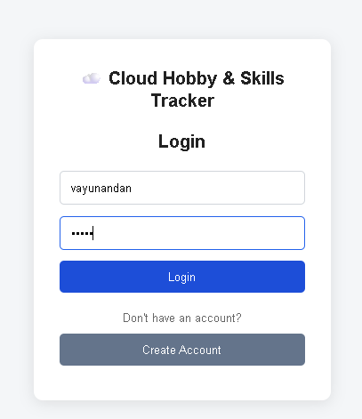
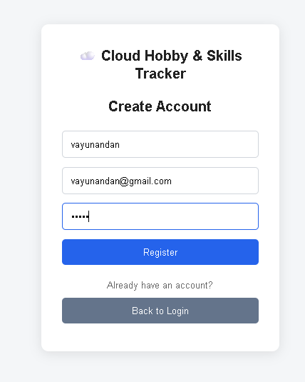
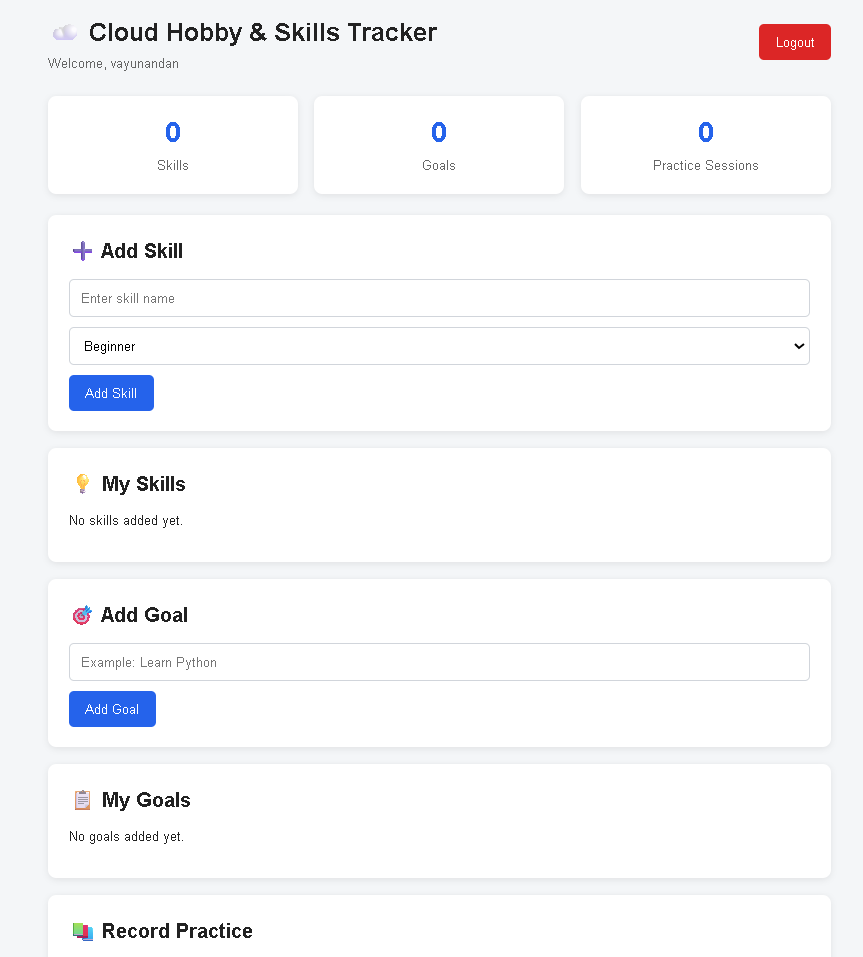
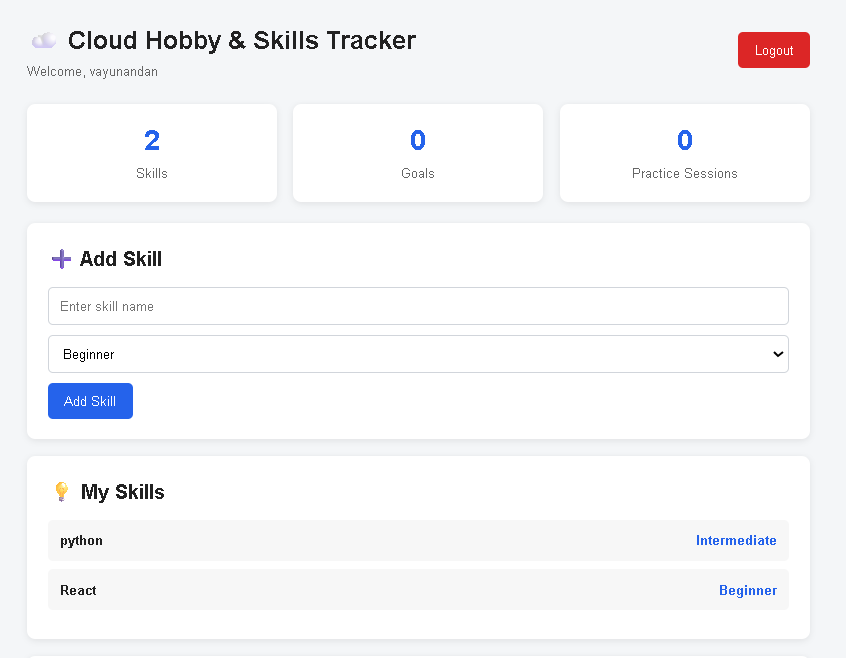
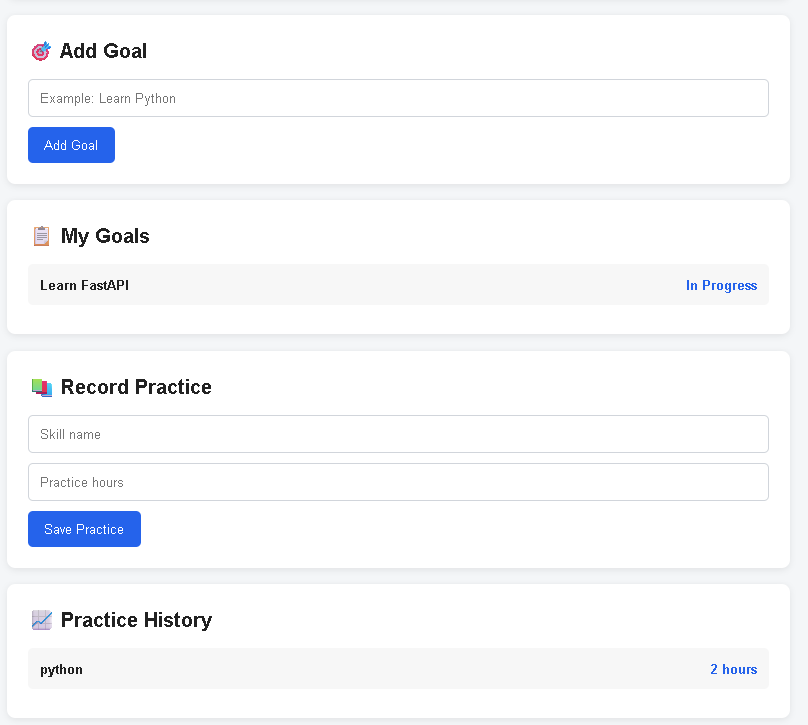
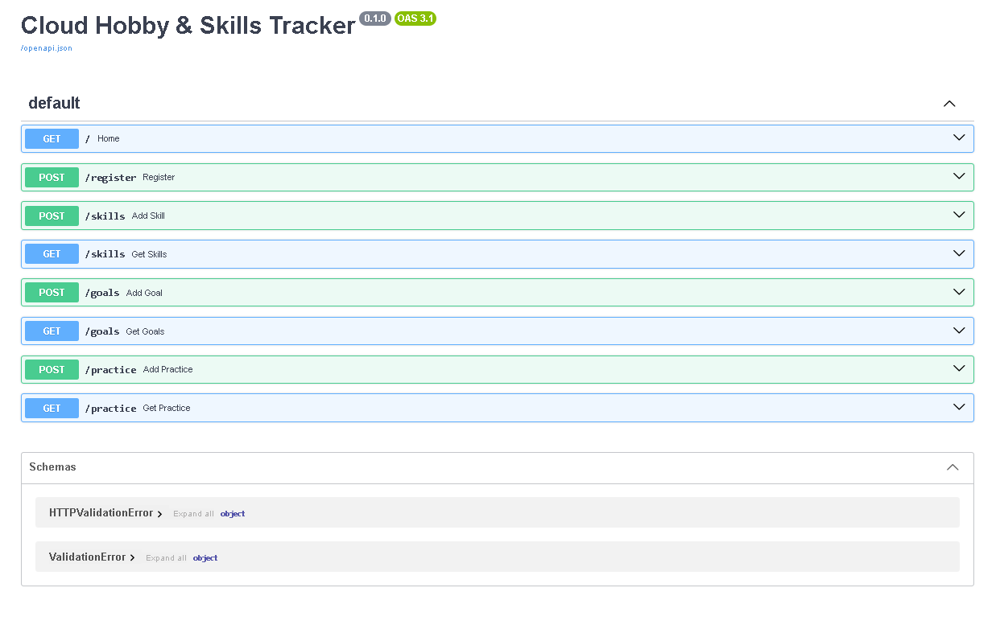

# ☁️ Cloud Hobby & Skills Tracker

A simple full-stack web application for managing personal skills, learning goals, and practice sessions through a clean and user-friendly dashboard.

Built using **React.js, JavaScript, FastAPI, Python, SQLAlchemy, and SQLite**, this project demonstrates frontend-backend communication, REST API development, database integration, and full-stack application architecture.

---

## 👨‍💻 Author

**Vayunandan Mishra**

ECE Student | Cloud Computing Enthusiast | Full-Stack Developer

- GitHub: https://github.com/Vayu-143
- Repository: https://github.com/Vayu-143/cloud-hobby-skills-tracker

---

## 📌 Project Overview

The **Cloud Hobby & Skills Tracker** is a full-stack learning management application designed to help users organize and track their technical skills, learning goals, and practice activities.

The application provides a simple dashboard where users can:

- Register an account
- Login to the application
- Add technical skills
- Select skill levels
- Create learning goals
- Record practice sessions
- Track practice hours
- Add practice notes
- View skills
- View learning goals
- View practice history
- Test backend APIs using Swagger UI

The project follows a simple **Frontend → REST API → Backend → Database** architecture.

---

## ✨ Key Features

### 🔐 User Authentication

- User registration
- User login
- Basic credential validation
- Logout functionality
- Local storage based login state

### 🧠 Skill Management

- Add new skills
- Select skill level
- Add skill descriptions
- View saved skills

### 🎯 Learning Goal Management

- Create learning goals
- Add goal descriptions
- Track goal status
- View saved goals

### ⏱️ Practice Tracking

- Record practice sessions
- Select the skill being practiced
- Enter practice hours
- Add practice notes
- View practice history

### 📊 Dashboard

The dashboard provides a centralized overview of:

- Total skills
- Total goals
- Total practice sessions
- Skill information
- Learning goals
- Practice history

### 🔌 REST API

FastAPI provides REST API endpoints for:

- User registration
- User login
- Skill management
- Goal management
- Practice management

### 📖 Swagger API Documentation

FastAPI automatically provides interactive API documentation through Swagger UI.

---

## 🖥️ Application Screenshots

### 🔐 Login



The login page allows registered users to access the application.

---

### 📝 Registration



New users can create an account using a username, email, and password.

---

### 📊 Dashboard



The dashboard provides a centralized view of skills, learning goals, and practice activities.

---

### 🧠 Skill Added



Users can add technical skills along with their skill level and description.

---

### 🎯 Learning Goal



Users can create and track learning goals from the dashboard.

---

### 🔌 FastAPI Swagger Documentation



FastAPI provides interactive API documentation for testing and exploring backend endpoints.

---

## 🏗️ System Architecture

```text
┌──────────────────────────────┐
│            User              │
│                              │
│ Login / Register / Tracking  │
└──────────────┬───────────────┘
               │
               ▼
┌──────────────────────────────┐
│       React Frontend         │
│                              │
│ • Login                      │
│ • Registration               │
│ • Dashboard                  │
│ • Skills                     │
│ • Goals                      │
│ • Practice Tracking          │
└──────────────┬───────────────┘
               │
               │ HTTP / REST API
               ▼
┌──────────────────────────────┐
│       FastAPI Backend        │
│                              │
│ • Authentication             │
│ • Skill APIs                 │
│ • Goal APIs                  │
│ • Practice APIs              │
└──────────────┬───────────────┘
               │
               ▼
┌──────────────────────────────┐
│        SQLAlchemy            │
│                              │
│       ORM Database Layer     │
└──────────────┬───────────────┘
               │
               ▼
┌──────────────────────────────┐
│        SQLite Database       │
│                              │
│            app.db            │
└──────────────────────────────┘
```

---

## 🛠️ Technology Stack

### Frontend

- React.js
- JavaScript
- Vite
- Axios
- HTML5
- CSS3

### Backend

- Python
- FastAPI
- Uvicorn
- SQLAlchemy

### Database

- SQLite

### Development Tools

- Visual Studio Code
- Git
- GitHub
- FastAPI Swagger UI
- npm

---

## 📁 Project Structure

```text
Cloud-Hobby-Skills-Tracker/
│
├── backend/
│   ├── main.py
│   ├── database.py
│   ├── models.py
│   ├── requirements.txt
│   └── .env
│
├── frontend/
│   ├── src/
│   │   ├── App.jsx
│   │   ├── Login.jsx
│   │   ├── Register.jsx
│   │   ├── api.js
│   │   ├── main.jsx
│   │   └── index.css
│   │
│   ├── package.json
│   └── vite.config.js
│
├── screenshots/
│   ├── api-swagger.png
│   ├── dashboard.png
│   ├── goal.png
│   ├── login.png
│   ├── register.png
│   └── skill_added.png
│
└── .gitignore
```

---

## 🔄 Application Flow

```text
User
 │
 ▼
Register / Login
 │
 ▼
React Dashboard
 │
 ├──────────────► Add Skill
 │
 ├──────────────► Create Goal
 │
 └──────────────► Record Practice
                    │
                    ▼
             FastAPI Backend
                    │
                    ▼
              SQLAlchemy ORM
                    │
                    ▼
             SQLite Database
                    │
                    ▼
              Stored Data
```

---

## 🔗 Backend API Endpoints

| Method | Endpoint | Description |
|---|---|---|
| GET | `/` | Check API status |
| POST | `/register` | Register a new user |
| POST | `/login` | Login user |
| POST | `/skills` | Add a skill |
| GET | `/skills` | Retrieve skills |
| POST | `/goals` | Add a learning goal |
| GET | `/goals` | Retrieve goals |
| POST | `/practice` | Add a practice session |
| GET | `/practice` | Retrieve practice history |

---

## 📖 API Documentation

After starting the backend server, open:

```text
http://localhost:8000/docs
```

This opens the **FastAPI Swagger UI**, where the available backend endpoints can be viewed and tested interactively.

---

## ⚙️ Installation & Setup

### 1. Clone the Repository

```bash
git clone https://github.com/Vayu-143/cloud-hobby-skills-tracker.git
cd cloud-hobby-skills-tracker
```

---

# 🔹 Backend Setup

### 2. Open the Backend Folder

```bash
cd backend
```

### 3. Create a Virtual Environment

Windows:

```bash
python -m venv venv
```

### 4. Activate the Virtual Environment

Windows PowerShell:

```bash
venv\Scripts\Activate.ps1
```

Windows Command Prompt:

```bash
venv\Scripts\activate
```

### 5. Install Backend Dependencies

```bash
pip install -r requirements.txt
```

### 6. Start the FastAPI Server

```bash
uvicorn main:app --reload
```

The backend will run at:

```text
http://localhost:8000
```

Swagger documentation:

```text
http://localhost:8000/docs
```

---

# 🔹 Frontend Setup

### 7. Open a New Terminal

Navigate to the frontend folder:

```bash
cd frontend
```

### 8. Install Frontend Dependencies

```bash
npm install
```

### 9. Start the React Development Server

```bash
npm run dev
```

The frontend will normally run at:

```text
http://localhost:5173
```

---

## ▶️ Running the Complete Application

Start the backend first:

```bash
cd backend
uvicorn main:app --reload
```

Then open a second terminal and start the frontend:

```bash
cd frontend
npm run dev
```

Open the frontend URL provided by Vite, normally:

```text
http://localhost:5173
```

---

## 🗄️ Database

The application uses **SQLite** as its database.

**SQLAlchemy** is used as the Object Relational Mapper (ORM) between the FastAPI backend and SQLite database.

### Database Entities

#### User

Stores:

- User ID
- Username
- Email
- Password

#### Skill

Stores:

- Skill ID
- Skill name
- Skill level
- Description

#### Goal

Stores:

- Goal ID
- Goal title
- Description
- Status

#### Practice

Stores:

- Practice ID
- Skill
- Practice hours
- Notes

---

## 🧩 Database Architecture

```text
FastAPI
   │
   ▼
SQLAlchemy ORM
   │
   ├── User
   ├── Skill
   ├── Goal
   └── Practice
   │
   ▼
SQLite
   │
   ▼
app.db
```

---

## 🔐 Security Note

This project is created as an **educational and portfolio project**.

The current authentication implementation is intentionally simple and is **not intended for production deployment**.

For a production-ready application, authentication and security should be improved using:

- Password hashing
- JWT authentication
- Secure session management
- Environment variables
- HTTPS
- Input validation
- Rate limiting
- Role-based authorization
- Secure database configuration

Sensitive configuration files should not be committed to GitHub.

---

## ☁️ Cloud Computing Relevance

Although the current version runs locally, the architecture provides a foundation for cloud deployment.

The project demonstrates concepts commonly used in cloud-based applications:

- Client-server architecture
- REST APIs
- Backend services
- Database integration
- API communication
- Environment configuration
- Frontend/backend separation
- Modular application architecture

A future cloud deployment can follow an architecture such as:

```text
React Frontend
      │
      ▼
Cloud Hosting
      │
      ▼
FastAPI Backend
      │
      ▼
Cloud Database
```

---

## 🧪 Testing Workflow

### User Authentication

1. Open the application.
2. Create a new account.
3. Login using the registered credentials.
4. Verify dashboard access.
5. Logout and login again.

### Skill Management

1. Open the dashboard.
2. Enter a skill name.
3. Select the skill level.
4. Add a description.
5. Submit the skill.
6. Verify that the skill appears on the dashboard.

### Goal Management

1. Enter a learning goal.
2. Add a description.
3. Submit the goal.
4. Verify that the goal is displayed.

### Practice Tracking

1. Enter the skill name.
2. Enter practice hours.
3. Add practice notes.
4. Submit the practice session.
5. Verify that the practice record appears in the history.

### API Testing

1. Start the FastAPI server.
2. Open `/docs`.
3. Select an API endpoint.
4. Click **Try it out**.
5. Enter the required parameters.
6. Execute the request.
7. Verify the API response.

---

## 🎯 Project Objectives

The main objectives of this project are:

- Build a complete full-stack web application.
- Understand frontend and backend communication.
- Develop REST APIs using FastAPI.
- Use SQLAlchemy for database operations.
- Work with SQLite databases.
- Build a responsive React interface.
- Practice CRUD-style application development.
- Understand basic authentication workflows.
- Create a portfolio-ready software project.
- Demonstrate cloud computing and web development concepts.

---

## 📚 Learning Outcomes

This project provides practical experience with:

- React component development
- JavaScript application logic
- REST API development
- FastAPI routing
- Python backend development
- SQLAlchemy ORM
- SQLite database management
- Axios API communication
- Frontend/backend integration
- Local storage
- API testing with Swagger
- Git and GitHub
- Full-stack project organization

---

## 🚀 Future Enhancements

Possible future improvements include:

- JWT-based authentication
- Password hashing
- User-specific skill management
- User-specific goals
- Progress percentage tracking
- Practice analytics
- Learning progress charts
- Skill search and filtering
- Goal completion tracking
- Profile management
- PostgreSQL database
- Cloud deployment
- Docker containerization
- CI/CD pipeline
- Cloud-hosted frontend and backend
- Role-based access control
- Production-grade security

---

## 📌 Current Project Status

The current version provides a working full-stack implementation with:

- React frontend
- FastAPI backend
- SQLite database
- SQLAlchemy ORM
- User registration
- User login
- Skill management
- Goal management
- Practice tracking
- Practice history
- Swagger API documentation
- GitHub repository

---

## 🌐 GitHub Repository

**Project Repository:**

https://github.com/Vayu-143/cloud-hobby-skills-tracker

**GitHub Profile:**

https://github.com/Vayu-143

---

## 👨‍💻 About the Developer

I am **Vayunandan Mishra**, an **ECE Student** interested in **Cloud Computing, Full-Stack Development, Python, Software Development, and modern web technologies**.

This project was developed as part of my practical learning and portfolio-building journey to demonstrate my understanding of full-stack application development, REST APIs, database integration, and cloud-oriented software architecture.

---

## ⭐ Support

If you find this project useful or interesting, consider giving the repository a ⭐ on GitHub.

---

## 📄 License

This project is intended for educational and portfolio purposes.

You may use, modify, and extend the project for learning purposes.

---

## 🙏 Acknowledgements

- React.js
- FastAPI
- SQLAlchemy
- SQLite
- Vite
- Axios
- GitHub
- Visual Studio Code

---

# ☁️ Cloud Hobby & Skills Tracker

**Built with React.js + FastAPI + SQLAlchemy + SQLite**

**Vayunandan Mishra | ECE Student | Cloud Computing Enthusiast | Full-Stack Developer**